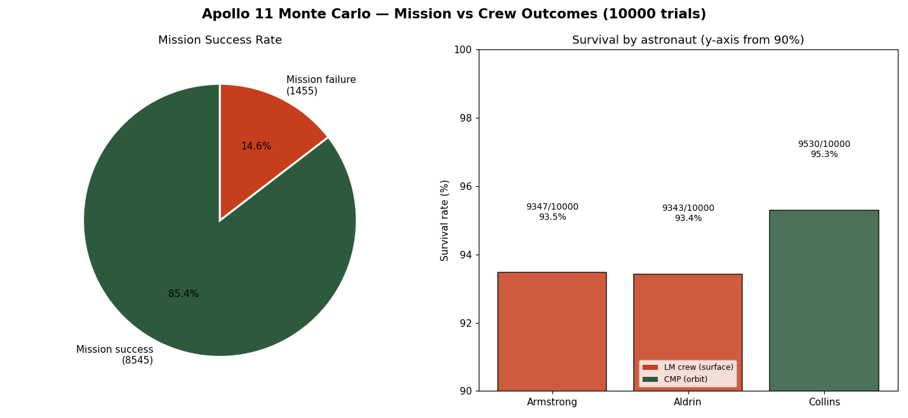
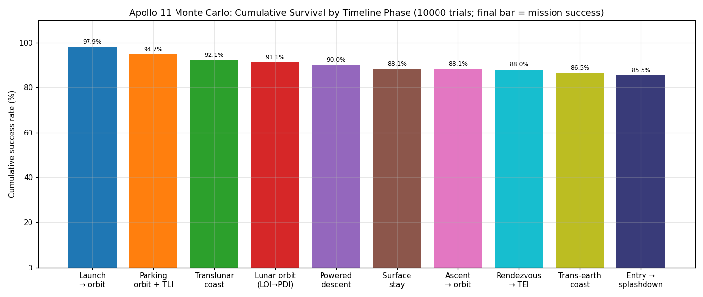
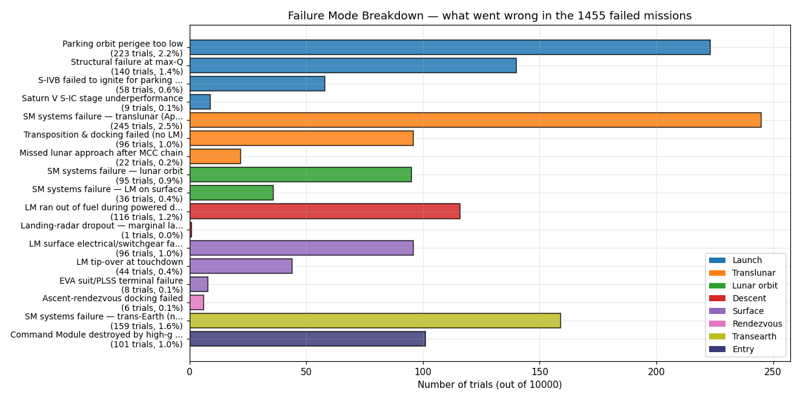
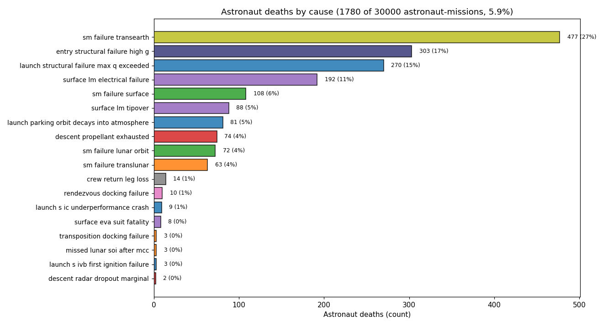

# Better Than Even Odds: A Physics-Integrated Monte Carlo Reassessment of Apollo 11's Probability of Success

*Target venue: Journal of the British Interplanetary Society (JBIS)*

## Abstract

What was Apollo 11's actual probability of success? Contemporary estimates spanned an
extraordinary range — an early NASA-commissioned reliability study put the chance of landing a
crew and returning them safely below 5%, the programme's design goals were set far higher, treating crew safety as near-certain, commander Neil Armstrong privately reckoned a 90% chance of
returning alive but only even odds on the landing itself, and command module pilot Michael
Collins reckoned he "wouldn't give better than even odds on a successful landing and return." None of these rested on an end-to-end physical simulation of the flight. We present
a physics-integrated Monte Carlo simulation that estimates Apollo 11's mission-success and
crew-survival probabilities by flying the entire mission — launch pad to splashdown — as one
continuous numerically-integrated trajectory. Every burn is a finite-thrust integration and
every coast a three-body integration under Earth (+J2) and Moon gravity, using a real July-1969
lunar ephemeris and a degree-8 GRAIL gravity field, with faithful renderings of Apollo's
guidance laws (iterative-guidance ascent, B-plane midcourse corrections, a predictor-corrector entry),
1969-era engine reliabilities, and a suite of failure modes sourced to the historical record
(Saturn V engine-out, an Apollo-13-class service-module failure, descent-propellant exhaustion,
docking, surface operations, and entry overstress). Across 10,000 trials, we estimate **85.5% mission success (95% CI 84.7–86.1%)** and **93.4%
crew survival**, with a per-astronaut abort-survival model attributing the roughly eight-point gap to
Apollo's abort architecture. The nominal trajectory reproduces Apollo 11's flown burn times, ΔV
budgets, and eight-day duration to within a few percent. The estimate falls squarely between the
crew's own intuition and the programme's eventual record of six successful landings in seven
attempts with no in-flight fatalities — and far above the early pessimistic forecast —
suggesting that a faithful physics model converges on a defensible mid-80s success probability
that contemporary risk assessment, lacking the computation, could not pin down.

## 1. Introduction

On 16 July 1969, three men rode the largest rocket then flown toward a body no human had
touched, on a flight plan whose every phase had been rehearsed only in pieces and never as a
whole. The world watched, and the world wondered the same thing the men aboard did: would it
work? In the decades since, Apollo 11 has become a fixed point of success in the public
imagination — the landing happened, the crew came home — and the contingency that hindsight
elides is how genuinely uncertain the outcome was beforehand. The question this paper asks is
the one that could not be answered in 1969 except by judgement: *what was Apollo 11's actual
probability of success?*

The estimates that existed at the time spanned nearly the entire interval from zero to one. At
the pessimistic extreme, an early NASA-commissioned reliability assessment is reported to have
put the probability of landing a crew on the Moon and returning them safely at under five
percent — a figure so discouraging that management is said to have set aside numerical risk
assessment for the remainder of the programme rather than publish it [1, 2]. Joseph Shea's early systems-architecting team had put it in starker, more visceral terms: thirty astronauts would be lost before three returned safely [3]. At the
optimistic extreme stood the programme's own ambitions: Apollo paid, by its leadership's account,
"extreme attention … to reliability and crew safety" [2], and its formal reliability goals were
correspondingly demanding — aspirations, it should be stressed, rather than measured expectations. Between these poles lay the judgement of the people closest to the
flight. Commander Neil Armstrong, asked afterward for his pre-flight assessment, recalled giving
the crew roughly a ninety-percent chance of returning alive but only even odds of accomplishing
the landing on the first attempt [4]. Command module pilot Michael Collins was blunter still: he "wouldn't give better than even
odds on a successful landing and return" [5]. The wider world hedged in its own currencies — bookmakers had reportedly offered a thousand to
one against a man reaching the Moon before 1971 and are said to have closed their books by launch week, and
the crew, unable to obtain ordinary life insurance, signed sheets of autographed covers for their
families to sell in the event they did not return [6]. The contingency was prepared at the
highest level: the White House of U.S. President Richard Nixon kept a statement — *In Event of Moon Disaster*, drafted by
speechwriter William Safire — ready for the President to deliver if Armstrong and Aldrin were
stranded on the lunar surface, after which NASA would close down communications and a clergyman
would commend their souls as in a burial at sea [7].

What none of these estimates rested on was a *physical* model of the flight. The programme's
reliability figures were component-and-subsystem apportionments rolled up through fault trees;
the crew's odds were expert intuition; the betting markets priced sentiment. The empirical record
that accumulated afterward — six successful landings in seven attempts, and no in-flight crew
fatalities across the eleven crewed Apollo missions, with Apollo 13 the programme's single
near-loss — is a frequentist estimate of immense authority but of small sample, and it post-dates
the question. Modern retrospective work has revisited the programme's risk numbers [1],
and detailed engineering reconstructions of individual Apollo trajectories abound, but these live
on opposite sides of a gap: the reliability literature works at the fault-tree level and does not
fly the mission, while the trajectory literature flies the mission but does not compute a
probability. To our knowledge, no published study has flown Apollo 11 end to end, thousands of
times, as an integrated physical simulation in order to estimate its probability of success.

This paper fills that gap. We construct a physics-integrated Monte Carlo simulation in which a
single trial is an entire Apollo 11 mission — pad to splashdown — propagated as one continuous
numerically-integrated trajectory: every powered manoeuvre a finite-thrust integration and every
coast a three-body integration under Earth (with the J2 oblateness term) and lunar gravity, the
latter using a real July-1969 lunar ephemeris and a degree-8 GRAIL gravity field. The vehicle is
flown with faithful renderings of Apollo's own guidance — iterative-guidance ascent steering, a
B-plane midcourse-correction chain, a two-burn lunar-orbit insertion, a predictor-corrector
atmospheric entry — and is subjected to 1969-era engine reliabilities and a suite of failure
modes drawn from the historical record, from Saturn V engine-out statistics to an
Apollo-13-class service-module failure. A per-astronaut survival model then maps each mission
outcome through Apollo's abort architecture to a crew-survival result, distinguishing — as the
programme itself did — the loss of the *mission* from the loss of the *crew*.

Across ten thousand such trials, we estimate a
mission-success probability of 85.5% (95% confidence interval 84.7–86.1%) and a crew-survival
probability of 93.4%, where a mission counts as a success if the crew reached the lunar surface and
all three returned to Earth alive — U.S. President John F. Kennedy's stated objective for the programme [8] — even where
a recovered in-flight anomaly occurred. The remainder of the paper describes the simulation (Section 2), the
failure and crew-survival models (Section 3), the validation of the nominal trajectory against
Apollo 11's flown values (Section 4), and the results and their decomposition by failure mode
(Section 5); Section 6 sets the estimate against the historical forecasts above and discusses
what it does and does not establish; and Section 7 sketches the planned extension of the model
to the Artemis programme. The headline finding can be stated simply here: a faithful
physical model places Apollo 11's odds squarely between the crew's own intuition and the
programme's eventual record — and far above the institutional pessimism that the early
assessment, lacking the means to compute it, could neither refine nor defend.

## 2. The Simulation

### 2.1 Overview

The unit of computation is the whole mission. A single Monte Carlo trial begins on the
launch pad and ends at Pacific splashdown, and in between the vehicle's state is advanced
by one continuous numerical integration of the equations of motion — there are no impulsive
manoeuvres, no patched conics, and no analytic hand-offs between phases. Every powered event
is integrated as a finite-thrust arc with the vehicle losing mass in real time, and every
coast is integrated as a three-body problem under Earth and lunar gravity. The guidance that
flies the vehicle through each phase is not a script of pre-computed states but a functional
rendering of Apollo's own steering laws, closing the loop on the same quantities the real
guidance closed on (orbital energy and plane at ascent, perilune and approach plane on the
translunar coast, flight-path angle and range at entry). This is the governing design choice
of the study: if the simulation is to produce a defensible probability of success, it must
*fly the mission the way Apollo flew it*, so that a trial fails for the reasons a real flight
could have failed rather than for the reasons a simplified model breaks.

The state vector carried through the integration is **y** = [x, y, z, ẋ, ẏ, ż, m] in an
Earth-Centred Inertial (ECI) frame — position (m), velocity (m s⁻¹), and instantaneous mass
(kg). Each run defines a single deterministic **nominal** mission, flown once with no
dispersions; this nominal both reproduces the Apollo 11 flight plan (Section 4) and captures
the targeting products — the lunar-approach B-plane aim point and the entry-interface state —
that the dispersed trials then fly toward. Each **dispersed trial** re-flies the same mission
with a sampled set of parametric dispersions and discrete failure draws (Sections 2.5 and 3).
The remainder of this section describes the force model (2.2), the vehicle (2.3), the guidance
and phase sequence (2.4), the Monte Carlo dispersions (2.5), and the implementation (2.6); the
catalogue of discrete failure modes and the crew-survival mapping are deferred to Section 3.

### 2.2 Dynamics and force model

Between thrusting events the spacecraft coasts, and its acceleration is the sum of the Earth's
gravity and three smaller perturbations. Writing **r** for the spacecraft's position relative to
the centre of the Earth and r = |**r**| for its distance,

  **r̈** = −μ⊕ **r**/r³ + **a**_J2 + **a**_Moon + **a**_Sun.

Here **r̈** is the acceleration — the second time-derivative of the position **r** — and the
first term on the right is the Earth's point-mass gravity, the dominant pull back toward the
Earth's centre, with μ⊕ = 3.986 004 418 × 10¹⁴ m³ s⁻² the Earth's gravitational parameter. The
remaining three terms are perturbations on that ideal two-body motion: **a**_J2, the correction
for the Earth's equatorial bulge (the J₂ zonal-harmonic term; J₂ = 1.082 6267 × 10⁻³, Earth
radius R⊕ = 6 378 137 m); **a**_Moon, the gravitational pull of the Moon; and **a**_Sun, that of
the Sun. The lunar and solar terms are standard third-body perturbations — the body's pull on
the spacecraft minus its pull on the Earth, the subtraction arising because the reference frame
is centred on the (itself-accelerating) Earth — and near the Moon **a**_Moon is replaced by the
full degree-8 lunar gravity field described in the next paragraph rather than a point mass.
During a powered phase one further term is added, the thrust acceleration
**a**_thrust = (T/m) **û** (thrust magnitude T, instantaneous mass m, commanded unit direction
**û**); the mass is then depleted at ṁ = −T/(I_sp g₀) (specific impulse I_sp, standard gravity
g₀ = 9.806 65 m s⁻²), so propellant is carried as a seventh state variable rather than assumed.

The system is integrated with an explicit Runge–Kutta method (SciPy's `solve_ivp`, RK45) at a
relative tolerance of 10⁻⁹. Step control is matched to the dynamics of each phase: coasts run
with a maximum step of up to 900 s, while powered arcs are constrained to a 2 s maximum step,
and discrete events — engine cutoff at a target speed, propellant depletion, flight-path-angle
crossings, and atmospheric-interface detection — are captured with SciPy's root-finding event
handling rather than by interpolation between coarse samples.

Lunar position is the single largest determinant of the return-plane geometry, and it is taken
from a real ephemeris. The Moon's
position is evaluated from a truncated Meeus series [9] (Astronomical Algorithms, ch. 47) at the
true Apollo 11 epoch (Julian Date 2 440 419.0639, i.e. 1969-07-16 13:32:00 UTC liftoff), and
Earth's rotation is anchored to the real Greenwich Mean Sidereal Time at launch; the ephemeris
was validated against Meeus's own worked example to better than one arc-second. Because a single
routine is the sole source of the Moon's position, this real-sky geometry propagates
consistently through translunar injection, lunar-orbit insertion, trans-Earth injection, and the
return.

Lunar gravity itself is evaluated to degree and order eight from the GRAIL **GRGM1200A** [10]
spherical-harmonic model (coefficients through degree 12 are embedded from the NASA Planetary
Data System for headroom, with the implied J₂ and C₂₂ checked against the code's independently
sourced lunar constants to within 0.003 %). The field is evaluated with a singularity-free Cunningham
recursion and is tier-gated to within ~3 500 km of the Moon, where it matters, with a degree-two
closed form used in the mid-field; under this field the lunar parking orbit evolves physically,
drifting at a rate inside Apollo's documented 5–20 km day⁻¹ band. True mare mascons (which live
at degrees ≳ 50, well beyond this field) are not represented as gravity; their dominant
operational effect — landing-point dispersion — is injected separately as a calibrated proxy.

### 2.3 Vehicle and propulsion

The vehicle is modelled as the Apollo 11 stack with its as-flown mass properties. The Saturn V
contributes the S-IC, S-II, and S-IVB stages; the spacecraft comprises the Command and Service
Module *Columbia* and the Lunar Module *Eagle*. Masses are taken from Orloff's *Apollo by the
Numbers* [11], with the service-module dry mass re-derived from the CSM-107
as-flown mass statement: *Columbia* is ~28 795 kg at translunar injection (command module
5 557 kg + service-module dry 4 825 kg + SPS propellant 18 413 kg), and *Eagle* is 15 103 kg
(descent stage 10 149 kg + ascent stage 4 954 kg). The propulsion set carries each engine's
rated performance: the Service Propulsion System (SPS) at 91 200 N and a specific impulse of 314.5 s;
the descent engine (Descent Propulsion System, DPS) throttleable between 45 040 N and 4 660 N
(its 10 % minimum); and the ascent engine (Ascent Propulsion System, APS) at 15 700 N [12]. Because every burn is integrated rather than applied as an instantaneous
ΔV, the as-flown thrust and specific-impulse values directly set the burn durations, which
provides an independent check on the calibration: the dispersed fleet reproduces Apollo's
lunar-orbit-insertion and trans-Earth-injection burn times to within roughly three percent
(Section 4).

### 2.4 Guidance and the mission spine

A trial is flown as an ordered chain of phases, each handed off to the next at the state the
integration actually reaches, so that a dispersion early in the flight is felt everywhere
downstream. Each phase is steered by a functional analogue of the corresponding Apollo guidance
law.

**Ascent and Earth parking orbit.** The vehicle is flown off the pad through an
azimuth-capable gravity turn and an iterative-guidance-mode (IGM) steering law to a 185 × 185 km
circular parking orbit at 32.5° inclination. The launch azimuth is not Apollo's nominal 72.058°
but a solved value of 72.48°, chosen so that the parking-orbit plane — after J₂ regresses its
node by about half a degree over the ~2.7 h parking coast — *contains the Moon-arrival direction
at the moment of translunar-injection ignition*. That the required correction is only ~0.4° is
itself an independent cross-check on the combined ephemeris, sidereal-time, and ascent model.

**Translunar injection (TLI).** The S-IVB reignites and is flown along a near-tangential
transfer (a departure roughly 170° from the Moon-arrival direction, preserving the
TEI-favourable arrival plane) under an IGM-style steered cutoff: constant pitch and yaw thrust
tilts (−2.35° and +2.54°) plus a cutoff speed, solved by a damped Newton iteration on
arrival time and periselene with an out-of-plane trim. The resulting capture is *retrograde* —
matching Apollo's actual approach handedness — and the burn is integrated with its own
propellant ledger against a finite reserve, so an unlucky combination of dispersions can
genuinely exhaust the stage.

**Translunar coast and midcourse corrections.** During the coast the trajectory is trimmed by a
midcourse-correction chain (MCC-1 through MCC-4) that solves a two-degree-of-freedom B-plane
problem — targeting both perilune altitude *and* the orientation of the approach plane rather
than altitude alone — bringing the approach-plane error to about 0.04°.

**Lunar-orbit insertion and descent.** A two-burn insertion places the CSM in a near-circular
~100 km orbit. A discrete descent-orbit-insertion burn (~19 m s⁻¹, charged to the descent
engine) then lowers only the Lunar Module's perilune to ~15 km, from which powered descent is
flown with an efficient braking law. The nominal lands with roughly a 95 s hover-fuel reserve
— close to Apollo's planned two-minute budget — with a fat tail (down to ~10 s) representing the
kind of hazard-avoidance overflight that left Apollo 11 itself landing with only seconds of
margin.

**Surface, ascent, rendezvous, and docking.** The lunar stay, ascent, and rendezvous are
advanced through the timeline; the rendezvous burns are modelled as a propellant-budget check
rather than flown as individual phasing manoeuvres, and docking is treated as a discrete event
with a sourced failure probability (Section 3).

**Trans-Earth injection (TEI).** From a scan over return opportunities, the TEI burn vector is
solved by a three-degree-of-freedom least-squares (trust-region) corrector that drives the
*integrated* return perigee into the entry corridor, with candidate opportunities scored by
their two-body departure asymptote (so the solver selects the Earth-ward, perigee-nulling
branch rather than a 10-day high-apogee crossing) and the return time targeted to Apollo's value;
the nominal enters at a flight-path angle of −6.5°.

**Trans-Earth coast and entry.** A second midcourse chain (MCC-5 through MCC-7) trims the
flight-path angle on the way home. Atmospheric entry is flown by a closed-loop, g-aware
numerical predictor–corrector: candidate bank angles are scored by predicted landing miss
(the prediction includes the skip and the peak deceleration), crossrange is controlled by
deadband bank reversals, and a predictive lift-up guard activates at 9.5 g against a 12 g
structural limit. The recovery point is taken at the short (direct-range) end of the entry
corridor — about 2 784 km downrange of the entry interface, Apollo's own design choice — which
makes the achieved range intrinsically insensitive to delivery dispersions.

**Splashdown.** Rather than a single fixed target, each trial aims at a *per-opportunity
recovery zone* — the standard practice of Mission Control's Real-Time Computer Complex (RTCC) — placed 2 784 km along that trial's own entry
ground track, so the reported miss measures guidance accuracy against the zone actually
reachable on the return opportunity flown.

Throughout, the phase timeline is held to Apollo's: a 26.7 h interval from lunar-orbit insertion
to powered descent and a 10.9 h interval from ascent to trans-Earth injection, giving a total
mission duration of about 8.18 days against Apollo 11's 8.14 [12].

### 2.5 Monte Carlo dispersions and structure

Each dispersed trial draws a set of parametric dispersions applied on top of the nominal
mission. The continuous dispersions are dominated by propulsion performance: every engine
(S-IC, S-II, S-IVB, SPS, DPS, APS) carries an independent specific-impulse error of ~0.3 % (1σ)
and a thrust error of 0.4–0.5 % (1σ). Injection is dispersed in position and velocity, with the
TLI execution error deliberately *calibrated* to a sourced accuracy target: the Saturn V
instrument-unit velocity-error specification at S-IVB cutoff was ±3.3 ft s⁻¹ per component
(conventionally a 3σ tolerance), and the pointing and bias inputs here are tuned so that the
total injection velocity-error magnitude is ~0.5 m s⁻¹ rms — at the level Apollo 11 actually
realised (1.6 ft s⁻¹ total) and just inside the specification. The trans-earth-injection
execution error is 0.5 m s⁻¹; the powered-descent hover-seek time is drawn from a
gamma(1.5, 3.0) distribution (mean 4.5 s) so that most landings need only minor repositioning
while a thin tail captures a prolonged hazard-avoidance search; and entry aerodynamics are
dispersed in drag coefficient (2 %) and lift-to-drag ratio (4 %). The *discrete* failure-mode
draws — launch engine-out events, an Apollo-13-class service-module failure, docking, surface
operations, and the rest — are described with their provenance in Section 3.

The Monte Carlo machinery is built for exact reproducibility: all per-trial perturbations are
generated up front from a single seeded random stream and dispatched to workers by trial index,
so a trial's outcome depends only on its index and the run reproduces exactly. Results are
checkpointed after every trial, making the run gap-safe and resumable. The definitive run
reported here used seed 37 and 10 000 trials.

### 2.6 Implementation and compute

The simulator is implemented in Python (NumPy/SciPy) in roughly 6 800 lines, and a single
trial costs about 625 s on one cluster core; run serially on a single core, the full
10,000-trial campaign would amount to roughly 1,700 core-hours — about 72 days of continuous
computation — which the cluster brought down to roughly seven hours of wall-clock time, since the trials are
mutually independent, they ran in parallel across the cluster's cores — an embarrassingly parallel
workload that scales almost linearly with the number of cores. The
definitive 10 000-trial run was executed on a
272-core SLURM cluster (17 nodes of 16 cores), with the trial set partitioned into disjoint
strided index subsets, run independently across the nodes, and merged. The nominal targeting
products — the entry-interface and B-plane aim points and the launch/TLI preset — are captured
once and pinned into the run directory, so that every shard flies toward identical targets and
node-to-node numerical differences cannot flip the marginal nominal-trajectory branches. The complete source, the regression tests, and the definitive run
are openly available (see Code and Data Availability).

The simulation software was developed, debugged, and analysed with substantial assistance
from a large language model (Claude, Anthropic) working under the author's direction; the
author specified the physics, guidance laws, failure modes, and validation targets, and
reviewed and verified all code, numerical results, and physical assumptions. A fuller
disclosure of this use appears in the declaration at the end of the paper.

## 3. Failure and Crew-Survival Models

Risk enters the simulation in two layers. The first is the set of continuous parametric
dispersions of Section 2.5 — engine performance, injection accuracy, hover time, entry
aerodynamics — which perturb the flown trajectory and can, on their own, produce a physical
loss (a parking orbit whose perigee is too low to survive to injection, a descent that
exhausts its propellant, an entry steeper than the structural limit). The second is a set of
*discrete failure modes* drawn per trial: hardware and operational events that the trajectory
integration alone would not produce — an engine that fails to ignite, an Apollo-13-class
service-module rupture, a docking that will not latch. This section describes those discrete
modes and their sourcing (Section 3.1), then the per-astronaut crew-survival model that maps
each mission outcome to a survival result (Section 3.2).

Two modelling rules apply throughout. First, the per-trial draws are taken in a fixed order from the single seeded stream, so each
trial's outcome is determined entirely by its index (Section 2.5). Second, the modes are evaluated in strict causal order along
the mission timeline and a trial is charged with at most one mission failure — the first one
that occurs — so the decomposition of Section 5 neither double-counts nor lets a late mode
mask an earlier one.

### 3.1 Discrete failure modes

Apollo flew too few times to furnish observed failure *frequencies* for most of these events
— the crewed Lunar Module flew nine times with zero descent, ascent, or rendezvous fatalities
— so every probability below is an engineering or expert-judgement estimate anchored to the
historical record, not a measured rate. Table 1 collects them.

**Table 1. Discrete failure-mode probabilities and their sourcing.**

| Mode | 1969-era probability | Basis |
|---|---|---|
| F-1 engine-out (S-IC) | 1.5% per engine per flight | No F-1 ever failed in flight (perfect Saturn record); a deliberately conservative reliability estimate. |
| J-2 engine-out (S-II) | 1.0% per engine | Apollo 6 lost two S-II J-2 engines; Apollo 13 lost its centre J-2 to pogo — the vehicle still reached orbit in both cases. |
| S-IVB ignition failure | 0.5% | Apollo 6's S-IVB failed to reignite; informed by the identified igniter-line fuel-leak modes. |
| SM catastrophic systems failure | 1 in 15 per mission (≈6.7%) | Empirical: one mission-ending service-module anomaly (Apollo 13) in fifteen crewed CSM flights. Struck at a uniform timeline fraction; the consequence depends on phase (see below). |
| Docking failure | 0.95% per docking | ≈2 capture anomalies in ~21 programme dockings × the unrecovered fraction; applied independently at both the transposition-and-docking and the ascent-rendezvous dockings. |
| LM surface electrical failure | 0.85% (0.17 × 0.05) | An anomaly rate × an unrecoverable fraction; anchored to Apollo 11's snapped ascent-engine arming circuit-breaker [13]. |
| LM tip-over at touchdown | 0.5% per landing | The LM's ~12° tip-over stability limit (Apollo 15 landed at ~11°). |
| EVA suit / PLSS fatality | 0.1% per mission | Zero failures in 28 programme man-EVAs; the OPS backup was never used. Modelled as a single moonwalker lost. |
| 1201/1202 computer alarm | 15% occurrence, 97% recovery | Apollo 11 itself fired five guidance-computer alarms, all recovered — a recoverable design/procedural event (a radar-switch configuration), not a random hardware hazard [13]. |
| Landing-radar dropout | 10% per descent | Harmless except on a descent already at a fuel margin under ~5 s, where the degraded guidance loses the landing. |
| Descent-propellant exhaustion | *emergent* | Not a fixed probability: arises when the hover-seek time (Section 2.5) and DPS performance dispersions together outlast the propellant. |
| High-g entry structural failure | *emergent* | Trajectory-dependent: a loss when the integrated peak deceleration exceeds the CM's ~12 g structural limit (NASA TN D-6725 [14] cites 10 g guidance / ~12 g structural). |

The service-module systems failure deserves emphasis because it is the single largest
contributor to mission loss (Section 5). It models the Apollo-13 class of event — a cryogenic
tank or fuel-cell rupture that ends the mission — and its consequence is set by *when* it
strikes. While the Lunar Module is still attached (the translunar coast and lunar orbit) the
crew has the demonstrated Apollo 13 lifeboat, so the abort is survivable at real
consumables-margin risk; with the LM on the surface the geometry is worse (the ascent stage
must launch immediately to an ailing CSM); and once the LM has been jettisoned for the
trans-Earth coast there is no lifeboat at all, and the CM's own batteries and surge tanks
last only hours.

### 3.2 The crew-survival model

A mission failure is not the same as a lost crew, and Apollo's abort architecture was
designed precisely to separate the two. The survival model therefore takes each trial's
mission outcome and maps it, per astronaut, to a survival result. The mapping turns on which
abort path the failure admits — Launch Escape System (Modes I–IV from the pad through the
S-IVB), continue-in-orbit, the free-return / LM-lifeboat return that saved Apollo 13, the
LM abort-stage procedure during descent, or, for an ascent-engine failure on the surface, no
return path at all. Each path carries an estimated survival probability: ~0.98 for a nominal
Launch Escape System abort, down to ~0.30 for a violent max-Q breakup; ~0.85–0.90 for the
LM-lifeboat returns; ~0.40 for the worst-geometry surface SM failure; and ~0.10 for the
post-jettison trans-Earth SM failure with no lifeboat. These values are anchored to the
NASA Lunar Landing Operational Risk Model (LLORM) [15], the Launch Escape System's ~98% design
reliability, and the Apollo 13 free-return precedent.

The model is resolved at the level of the individual crewman because the three were not
equally exposed. Collins, alone in the Command and Service Module, never descends to the
surface; he is exposed to every whole-stack hazard (launch, translunar, trans-Earth, entry)
but to none of the descent, surface, ascent, or rendezvous risks, and if the Lunar Module
crew is lost his documented contingency is to return to Earth alone. Armstrong and Aldrin
share the Lunar Module and therefore share every LM-phase fate — with one exception, a
terminal EVA suit failure, which kills exactly one of them (the suit-failure victim, chosen
at random). Three exposure classes capture this: *whole-stack* modes that the three share,
*LM-crew* modes that spare Collins, and the *single-moonwalker* EVA mode. The construction
guarantees by design that Collins's survival probability is never below the moonwalkers'.

Two further refinements make the death accounting honest. First, each astronaut's death is
attributed to what actually killed *him*: a crewman who survives the precipitating event but
then dies on the Earth-return leg — Collins returning solo after the Lunar Module crew is
lost, say, or a crew that aborts successfully but does not survive the return — is charged to
a distinct *crew-return-leg loss* cause, not to the upstream mode that killed his crewmates
(this is the variable-lethality entry in Table 4). Second, a fully successful, anomaly-free
mission assigns survival probability exactly 1.0: Apollo had zero recovery-phase fatalities
across all crewed flights, so all residual crew risk lives in the explicit failure modes
rather than in a spurious nominal hazard.

The honest caveat is the one stated above: outside the launch phase these are
expert-judgement estimates against a near-empty observational record, and the dominant
driver — the per-phase survival split of the service-module failure — is the least
constrained of them. Section 6 returns to what this implies for the headline estimate.

## 4. Validation of the Nominal Trajectory

The dispersed trials are only as meaningful as the nominal mission they perturb, so before
presenting the Monte Carlo results we check that the nominal — the single deterministic
flight flown with no dispersions — reproduces Apollo 11's actual trajectory. Table 2
compares the nominal against the flown values (from the Saturn V Flight Evaluation Report [16],
Orloff's *Apollo by the Numbers* [11], and the Apollo 11 Mission Report [13]).

**Table 2. Nominal trajectory versus Apollo 11 as-flown.**

| Quantity | Nominal | Apollo 11 | Error |
|---|---:|---:|---:|
| TLI ΔV (m s⁻¹) | 3137 | 3153 | −0.5% |
| Lunar approach periapsis (km) | 97.0 | 110 | −11.8% |
| LOI burn time (s) | 370.0 | 357 | +3.6% |
| TEI ΔV (m s⁻¹) | 996 | 1008 | −1.2% |
| TEI burn time (s) | 162.1 | 152 | +6.6% |
| Entry flight-path angle (°) | −6.51 | −6.49 | −0.4% |
| Entry speed (m s⁻¹) | 11 031 | 11 032 | −0.0% |
| Peak entry deceleration (g) | 8.6 | 6.5 | +31.8% |
| Total mission duration (days) | 8.18 | 8.14 | +0.5% |

The agreement is close on the quantities that matter most for a risk estimate. The two
largest ΔV events — translunar and trans-Earth injection — match to about one percent, their
burn times to within three-to-seven percent (the burn-time errors follow directly from the
as-flown thrust and specific-impulse values, since every burn is integrated rather than
applied impulsively, and are the cleanest single check on the mass calibration of
Section 2.3). The entry interface is reproduced almost exactly — a flight-path angle of
−6.51° against the flown −6.49° and an entry speed within a metre per second — and the total
mission duration matches Apollo's 8.14 days to within a few hours, with the flown 26.7-hour
lunar-orbit-insertion-to-powered-descent interval held by construction.

Two rows diverge materially, and we report them rather than tune them away. The peak entry
deceleration is the most visible: the nominal pulls ~8.6 g where Apollo pulled 6.5. This is a
known profile-shape residual — reproducing Apollo's gentler 6.5 g requires an FPA-indexed
HUNTEST-style reference-deceleration profile with closed-loop drag tracking, which the
current model does not implement; the guided entry instead flies a
direct, dispersion-insensitive corridor that lands accurately (~1 km) but more steeply. The
deceleration matters for the high-g failure mode (Section 5) but not for the landing
accuracy. The lunar-approach periapsis sits ~12% low — a second-order effect of the simplified
lunar-approach geometry noted among the limitations. The nominal
descent-fuel margin (~100 s) is the *anomaly-free* reserve, close to Apollo's planned
two-minute hover budget; Apollo 11's famous ~25 s as-flown margin was the result of a long
manual boulder-field overflight, and that case lives in the Monte Carlo tail rather than at
the nominal.

Two independent cross-checks fall out of the construction. The launch azimuth required so
that the J2-regressed parking-orbit plane contains the Moon-arrival direction at injection
solves to 72.48°, within ~0.4° of Apollo 11's as-flown 72.058° — an agreement that neither
the ephemeris, the sidereal-time anchoring, nor the ascent model was tuned to produce. And
the lunar ephemeris itself reproduces Meeus's published worked example to better than one
arc-second.

## 5. Results

We ran 10,000 trials (seed 37) on a 272-core cluster.
A trial counts as a **mission success** if the crew reached the lunar surface *and* all
three astronauts returned to Earth alive — U.S. President John F. Kennedy's stated objective for the programme [8] —
even where a recovered in-flight anomaly occurred; it counts as a **failure** only if the landing was
never achieved or at least one crew member died. We estimate a mission-success
probability of **85.5%** (Wilson 95% CI 84.7–86.1%) and a crew-survival probability of
**93.4%**. Of the 8,545 successful missions, 8,404 were flawless and 141 succeeded despite
a recovered anomaly (for example a docking-mechanism failure resolved by a contingency EVA
crew transfer, or a service-module failure that struck late enough on the trans-Earth coast
for the crew to ride the remaining consumables home).

### 5.1 Headline: mission success and crew survival

**Figure 1. Mission success and crew survival.** *Left:* of 10,000 simulated missions,
85.5% achieved the full objective (landing plus the safe return of all three astronauts)
and 14.5% did not. *Right:* per-astronaut survival — Armstrong 93.5%, Aldrin 93.4%, and
Collins 95.3%. Collins survives slightly more often because, alone in the Command and
Service Module, he is never exposed to the descent, surface, ascent, and rendezvous
hazards the two moonwalkers face; the small Armstrong–Aldrin difference arises solely from
the single-victim EVA-suit failure mode. All three returned alive in 93.4% of missions.

### 5.2 Where missions are lost

**Figure 2. Cumulative survival by timeline phase.** Each bar is the fraction of the 10,000
missions whose objective was still achievable at the end of that phase — i.e. that had not
been irrecoverably lost in it or any earlier phase. A recovered anomaly does not lose the
mission, so such a trial clears every phase; the bars therefore step down monotonically and
the final bar equals the 85.5% mission-success rate. The largest single drops occur in the
launch and parking-orbit/TLI phases and on the translunar coast, consistent with the failure
decomposition below.

### 5.3 Failure decomposition

Across the 1,455 failed missions, the losses decompose by mission phase as shown in
Figure 3 and Table 3. (The 141 recovered-anomaly successes are *not* counted here: a
recorded anomaly on a mission that nonetheless landed and brought everyone home is not a
failure.) The single largest contributor is the Apollo-13-class service-module systems
failure, which — summed across the translunar, lunar-orbit, surface, and trans-Earth phases
— accounts for about 5.4% of all trials; the Saturn V launch family is next at 4.3%.

**Figure 3. Failure-mode breakdown.** The 1,455 mission failures, grouped by the mission
phase in which the loss occurs and ordered chronologically. See Table 3 for counts and
plain-language explanations.

**Table 3. Failure decomposition (of 10,000 trials).** Percentages are of all trials.
Recovered-anomaly successes are excluded.

| Phase | Failure mode | Trials | % | What happens |
|---|---|---:|---:|---|
| Launch | Parking-orbit perigee too low | 223 | 2.23 | S-IVB underperformance / guidance dispersion leaves a parking-orbit perigee below ~80 km; the orbit would decay before TLI. |
| Launch | Structural failure at max-Q | 140 | 1.40 | Aerodynamic loading exceeds the ~50 kPa structural limit in transonic flight under an off-nominal thrust profile. |
| Launch | S-IVB failed to ignite | 58 | 0.58 | The third-stage J-2 fails to fire after S-II burnout; the stack stays on a suborbital trajectory. |
| Launch | S-IC underperformance | 9 | 0.09 | Multiple early F-1 failures rob first-stage thrust; the vehicle falls back. |
| Translunar | SM systems failure — translunar (Apollo-13 class) | 245 | 2.45 | Catastrophic SM failure on the outbound coast, LM attached; recovered via the LM-lifeboat abort at real consumables-margin risk. |
| Translunar | Transposition & docking failed | 96 | 0.96 | The CSM cannot extract the LM from the S-IVB; the landing is aborted and the crew returns on a healthy CSM. |
| Translunar | Missed lunar approach after MCC | 22 | 0.22 | After the full midcourse chain the perilune is still outside the LOI-recoverable band. |
| Lunar orbit | SM systems failure — lunar orbit | 95 | 0.95 | Catastrophic SM failure in lunar orbit; LM-lifeboat abort from tighter consumables than Apollo 13's free return. |
| Lunar orbit | SM systems failure — LM on surface | 36 | 0.36 | SM fails with the LM on the surface; emergency liftoff to an ailing CSM — the worst pre-jettison geometry. |
| Descent | Descent-propellant exhaustion | 116 | 1.16 | The DPS is exhausted before touchdown after a long hazard-avoidance overfly combined with performance dispersions. |
| Descent | Landing-radar dropout — marginal | 1 | 0.01 | A radar blackout that is fatal only when the fuel margin is already under ~5 s. |
| Surface | LM electrical / switchgear failure | 96 | 0.96 | An unrecoverable surface electrical fault prevents arming the ascent engine; the LM crew is stranded. |
| Surface | LM tip-over at touchdown | 44 | 0.44 | The LM tips beyond the ~12° stability limit; no ascent is possible. |
| Surface | EVA suit / PLSS terminal failure | 8 | 0.08 | A terminal suit/PLSS failure during EVA, modelled as one moonwalker lost. |
| Rendezvous | Ascent-rendezvous docking failed | 6 | 0.06 | Hard-dock fails *and* the EVA-transfer contingency is also lost. |
| Trans-Earth | SM systems failure — trans-Earth (no lifeboat) | 159 | 1.59 | Apollo-13-class SM failure after LM jettison, with no lifeboat; fatal to all three (survivable late strikes are counted as successes). |
| Entry | High-g structural failure | 101 | 1.01 | A steep flight-path-angle dispersion pushes peak deceleration past the 12 g structural limit. |
| **Total** | | **1,455** | **14.55** | |

### 5.4 Crew survival and cause of death

**Figure 4. Astronaut deaths by cause.** Of 30,000 astronaut-missions (three crew ×
10,000 trials), 1,780 deaths occurred (5.9%). Bars show the share attributable to each
cause; a crewman lost on the Earth-return leg after surviving the precipitating event is
charged to *crew-return-leg loss*, not to the upstream mode that killed his crewmates.

All three astronauts returned alive in **9,341 of 10,000** missions (93.4%); **659**
missions (6.6%) were fatal to at least one crew member. Table 4 gives the per-cause death
accounting, including the lethality pattern — how many of the three die when a given cause
strikes. Most modes have a fixed lethality (the whole-stack losses always kill three;
LM-surface modes always kill the two moonwalkers; the EVA-suit failure always kills one),
while crew-return-leg loss is variable.

**Table 4. Astronaut deaths by cause.** "Trials" is the number of missions in which the
cause killed at least one astronaut; "Lethality" is how many of the three die when it does.

Astronauts killed per affected trial:
always&nbsp;1 (one moonwalker — EVA suit) &nbsp;
always&nbsp;2 (both moonwalkers; Collins survives) &nbsp;
always&nbsp;3 (whole stack) &nbsp;
variable (return-leg draw).

<table>
<tr><th>Cause</th><th>Deaths</th><th>Trials</th><th>Lethality</th></tr>
<tr><td>SM systems failure — trans-Earth</td><td>477 (26.8%)</td><td>159 (1.6%)</td><td style="text-align:center">always 3</td></tr>
<tr><td>High-g entry structural failure</td><td>303 (17.0%)</td><td>101 (1.0%)</td><td style="text-align:center">always 3</td></tr>
<tr><td>Launch structural failure (max-Q)</td><td>270 (15.2%)</td><td>90 (0.9%)</td><td style="text-align:center">always 3</td></tr>
<tr><td>LM surface electrical failure</td><td>192 (10.8%)</td><td>96 (1.0%)</td><td style="text-align:center">always 2</td></tr>
<tr><td>SM systems failure — surface</td><td>108 (6.1%)</td><td>36 (0.4%)</td><td style="text-align:center">always 3</td></tr>
<tr><td>LM tip-over at touchdown</td><td>88 (4.9%)</td><td>44 (0.4%)</td><td style="text-align:center">always 2</td></tr>
<tr><td>Parking-orbit decay</td><td>81 (4.6%)</td><td>27 (0.3%)</td><td style="text-align:center">always 3</td></tr>
<tr><td>Descent-propellant exhaustion</td><td>74 (4.2%)</td><td>37 (0.4%)</td><td style="text-align:center">always 2</td></tr>
<tr><td>SM systems failure — lunar orbit</td><td>72 (4.0%)</td><td>24 (0.2%)</td><td style="text-align:center">always 3</td></tr>
<tr><td>SM systems failure — translunar</td><td>63 (3.5%)</td><td>21 (0.2%)</td><td style="text-align:center">always 3</td></tr>
<tr><td>Crew-return-leg loss</td><td>14 (0.8%)</td><td>6 (0.1%)</td><td style="text-align:center">variable (1–3)</td></tr>
<tr><td>Ascent-rendezvous docking failure</td><td>10 (0.6%)</td><td>5 (0.1%)</td><td style="text-align:center">always 2</td></tr>
<tr><td>S-IC underperformance</td><td>9 (0.5%)</td><td>3 (0.0%)</td><td style="text-align:center">always 3</td></tr>
<tr><td>EVA suit / PLSS failure</td><td>8 (0.4%)</td><td>8 (0.1%)</td><td style="text-align:center">always 1</td></tr>
<tr><td>Transposition &amp; docking failure</td><td>3 (0.2%)</td><td>1 (0.0%)</td><td style="text-align:center">always 3</td></tr>
<tr><td>Missed lunar approach after MCC</td><td>3 (0.2%)</td><td>1 (0.0%)</td><td style="text-align:center">always 3</td></tr>
<tr><td>S-IVB first-ignition failure</td><td>3 (0.2%)</td><td>1 (0.0%)</td><td style="text-align:center">always 3</td></tr>
<tr><td>Landing-radar dropout</td><td>2 (0.1%)</td><td>1 (0.0%)</td><td style="text-align:center">always 2</td></tr>
<tr><td><strong>Total</strong></td><td><strong>1,780</strong></td><td></td><td></td></tr>
</table>

The gap between the 93.4% crew-survival rate and the 85.5% mission-success rate — about
eight points — is Apollo's abort architecture made quantitative: it is essentially the set
of missions that aborted before a landing yet still brought the crew home (a launch escape,
a translunar lifeboat return, an aborted transposition-and-docking with a healthy CSM, and
the like). The launch family illustrates the same effect within a single phase: the 140
max-Q breakups and 223 parking-orbit decays are mission losses, but the Launch Escape System
and a contingency deorbit save many of those crews, so they contribute far fewer deaths
(270 and 81) than their mission-failure counts would suggest.

## 6. Discussion

A physics-integrated model that flies Apollo 11 ten thousand times places its probability of
mission success at 85.5% (95% CI 84.7–86.1%) and crew survival at 93.4%. It is worth setting
those numbers against the forecasts of the Introduction, because the estimate lands in a
revealing place among them.

It is, first, far above the institutional pessimism. The early NASA-commissioned assessment
that put the chance of landing a crew and returning them safely below five percent is not
merely low but the wrong order of magnitude: nothing in a faithful flight of the mission
reproduces it, and the gap is most naturally read as the difference between a fault-tree
roll-up of conservative component reliabilities and an integration that lets Apollo's
guidance, aborts, and propellant margins actually do their work. It is, second, short of the
programme's aspirational design goals, which treated crew safety as a near-certainty; the gap is
sharpest there — a 93.4% crew-survival probability is far from near-certain — though it remains
comfortably above the ~90% chance of returning alive that Armstrong privately reckoned. Those
goals were targets, not predictions. And it is, third and most pointedly, on the optimistic
side of the crew's own intuition about the part they doubted most. Both Armstrong and Collins
gave the *landing itself* no better than even odds; the model gives the full objective — the
landing and the safe return together — better than even by a wide margin. On the question
they were most uncertain about, a faithful physical model says the odds were better than they
feared.

The estimate also sits remarkably close to the empirical record that accumulated afterward,
in two independent ways. Six of the seven Apollo landing attempts succeeded — 85.7% — against
our 85.5% mission-success probability; the coincidence should not be over-read (our model is
Apollo 11 specifically, the first and least-rehearsed attempt, while the record mixes in later,
more mature missions, and seven flights is a small sample) but it is striking that a
bottom-up physical model and the top-down frequency land on the same number. The crew-survival
side corroborates differently: at a 6.6% per-mission chance of losing at least one crew member,
the probability of completing eleven crewed Apollo flights with no in-flight fatality is
roughly even (≈0.934¹¹ ≈ 0.5) — which is to say the model regards Apollo's actual outcome, a
clean record with Apollo 13 as the single near-loss, not as a near-miracle but as a coin-flip
that went the programme's way. That the dominant survival risk in the model is precisely an
Apollo-13-class service-module failure, and that Apollo 13 was precisely the flight that
realised it, is the kind of qualitative agreement that lends the decomposition some
credibility.

What the model does *not* establish bounds these claims. The most consequential limitation is
that navigation is open-loop: the deep-space targeting solves are computed once from the
nominal and flown without the continuous ground-tracking re-solution that Apollo actually had.
A share of the deep-space losses — the missed-approach cases, the larger-than-Apollo
trans-Earth trims — is therefore solver fragility rather than 1969 risk, which means the true
mission-success probability is, if anything, likely a little *higher* than 85.5%; closing this
gap is the natural next fidelity frontier. The same open-loop limitation bears on crew survival:
the model affords the crew none of the real-time, on-console improvisation that brought Apollo 13
home, so the 93.4% figure — already below both the programme's fatality-free flight record and
the near-certain crew safety it aspired to — is likewise plausibly conservative. The second caveat is sensitivity: the
service-module systems failure is the single largest contributor to both mission loss and
crew loss, and while its 1-in-15 occurrence rate is empirically grounded, its per-phase
survival split — how often the crew lives when it strikes translunar versus on the surface
versus on the trans-Earth coast — is the least-constrained estimate in the model, so the
headline carries a corresponding sensitivity to that one mode. Lesser limitations are
catalogued elsewhere and bias the estimate only at the margins: the ~8.6 g entry profile
versus Apollo's 6.5 g (a profile-shape residual that affects the high-g failure mode but not
landing accuracy), a static atmosphere with no winds or weather, the rendezvous burns modelled
as a propellant budget rather than flown, and lunar mascons represented as a calibrated
landing-dispersion proxy rather than as gravity.

With those caveats stated, the central finding is simple and, we think, robust to them. The
question of Apollo 11's odds could not be answered in 1969 except by judgement, because the
computation that would settle it was not available; supplied now, that computation places the
mission's probability of success in the mid-eighties — between the crew's own wary intuition
and the programme's eventual record, and far above the institutional pessimism that, lacking
the means to compute it, could neither refine nor defend its own worst guess. Apollo 11, on
the evidence of a faithful re-flight, was better than even odds.

## 7. Future Work

Beyond the refinements internal to the Apollo 11 model (notably better-sourced
service-module failure statistics, a closed-loop ground-tracking navigation layer, and a
6.5-g HUNTEST-style entry profile), we intend to extend the simulation beyond Apollo to the
Artemis lunar programme in two stages. The first is *retrospective validation* against the two
Artemis missions that have already flown: Artemis I, the uncrewed lunar flight, and Artemis II,
the first crewed flight (a free-return lunar flyby). Modelling both — one uncrewed and one
crewed, each with a known real-world outcome — exercises the approach against contemporary
flight hardware and a modern trajectory, and tests whether it reproduces two further independent
results rather than the single Apollo 11 anchor. The second stage is a *forward* estimate: the
mission-success and crew-survival probabilities of Artemis III, the first crewed lunar landing
since Apollo, currently scheduled for 2027 — computed **before it flies**. Artemis III is the
closest modern analogue to Apollo 11 (a crewed descent to and ascent from the lunar surface),
which makes it both the most natural extension of this model and a rare opportunity to commit a
physics-based risk prediction to the record in advance, to be tested against an actual flight
rather than against history.

## Code and Data Availability

The complete simulation source code is openly available at
`https://github.com/<user>/<repo>` *(URL to be finalised)* under an open-source licence, so
that any reader may **reproduce, independently verify, or improve** the results presented here.
The repository includes the simulation itself (`apollo11.py`), the crew-survival model
(`crew_survival.py`), the figure/dashboard generator (`generate_outputs.py`), the embedded
GRAIL lunar-gravity coefficients, the regression tests, and the cluster job-submission
pipeline (`submit_mc.sh`, `cluster_run.py`), together with the full output of the definitive
10,000-trial run (`apollo11_final10000/`: per-trial results, the nominal trajectory, captured
targeting products, and the generated dashboard). Only this definitive run is included, to
keep the repository compact; every result in this paper can be regenerated from the released
code and the definitive run directory.

## Use of Generative AI

During the preparation of this work the author used Claude (Anthropic; Claude Opus 4.8) to assist
with developing, debugging, and extending the simulation software; running and analysing the
Monte Carlo experiments on the compute cluster; and drafting and editing this manuscript. The
author directed the work throughout, and reviewed, verified, and edited all code, numerical
results, physical assumptions, and text. The author takes full responsibility for the content of
this publication. (A corresponding note on the AI's role in the research itself appears in the
Methods/Section 2.)

## References

1. Jones, H. W. (2019). *Program Promotion Can Distort Space Systems Engineering and Deny
   Risk.* 49th International Conference on Environmental Systems (ICES-2019-16), Boston, MA,
   7–11 July 2019. NASA NTRS 20190027320.
2. Jones, H. W. (2019). *NASA's Understanding of Risk in Apollo and Shuttle.* NASA Ames
   Research Center, NTRS 20190002249.
3. Rechtin, E. (2000). *Systems Architecting of Organizations.* CRC Press, Boca Raton, FL.
   (Source of Joseph Shea's Apollo architecting-team reliability reckoning, as quoted in [2].)
4. Armstrong, N. A. Interview with Alex Malley, CPA Australia, 2011 — "I thought we had a
   90 percent chance of getting back to Earth on that flight, but only a 50-50 chance of making
   a successful landing on the first attempt." Widely reported (e.g. CNN, 25 May 2012;
   *Scientific American*, 2012).
5. Collins, M. Contribution to *Apollo Expeditions to the Moon* (E. M. Cortright, ed.), NASA
   SP-350, 1975 ("…I wouldn't give better than even odds on a successful landing and return").
6. Apollo insurance covers. The Apollo 11 crew, unable to obtain affordable in-flight life
   insurance, signed postal "covers" for their families to sell in the event they did not
   return. See NPR Planet Money, "What the Apollo Astronauts Did for Life Insurance,"
   30 August 2012.
7. Safire, W. (1969). *In Event of Moon Disaster.* Memorandum to H. R. Haldeman, 18 July 1969.
   U.S. National Archives (Richard Nixon Presidential Library and Museum materials).
8. Kennedy, J. F. (1961). *Special Message to the Congress on Urgent National Needs* ("…landing
   a man on the Moon and returning him safely to the Earth"), 25 May 1961. John F. Kennedy
   Presidential Library and Museum.
9. Meeus, J. (1998). *Astronomical Algorithms,* 2nd ed. Willmann-Bell, Richmond, VA.
10. Goossens, S., et al. (2016). *A Global Degree and Order 1200 Model of the Lunar Gravity
   Field Using GRAIL Mission Data (GRGM1200A).* 47th Lunar and Planetary Science Conference,
   Abstract #1484.
11. Orloff, R. W. (2000). *Apollo by the Numbers: A Statistical Reference.* NASA SP-2000-4029,
    NASA History Division, Washington, DC.
12. NASA (1969). *Apollo 11 Press Kit.* Release No. 69-83K, 6 July 1969. NASA NTRS 19690022248.
13. NASA Manned Spacecraft Center (1969). *Apollo 11 Mission Report.* MSC-00171, November 1969.
14. Graves, C. A., and Harpold, J. C. (1972). *Apollo Experience Report — Mission Planning for
    Apollo Entry.* NASA Technical Note TN D-6725, Manned Spacecraft Center, Houston, TX.
15. Mattenberger, C., Putney, B., Rust, R., and Derkowski, B. (2010). *Lunar Landing
    Operational Risk Model.* 10th International Probabilistic Safety Assessment and Management
    Conference (PSAM-10), Seattle, WA. NASA JSC-CN-20247 (NTRS 20100018589).
16. Marshall Space Flight Center (1969). *Saturn V Launch Vehicle Flight Evaluation Report —
    AS-506 Apollo 11 Mission.* MPR-SAT-FE-69-9, NASA MSFC, Huntsville, AL.
